# Class Diagram - ChronoLens

> Note: Backend is Node.js. JavaScript classes are used throughout. All classes follow OOP principles - encapsulation, abstraction, inheritance, and polymorphism.

```mermaid
classDiagram

    %% ─── ENUMS (as constant objects in Node.js) ──────────────────
    class Category {
        <<enumeration>>
        WAR_BATTLE
        POLITICS
        SCIENCE_INNOVATION
        CULTURE_ART
        DISASTER
        FAMOUS_BIRTH_DEATH
        UNKNOWN
    }

    class Era {
        <<enumeration>>
        ANCIENT
        MEDIEVAL
        COLONIAL
        MODERN
        CONTEMPORARY
        UNKNOWN
    }

    %% ─── CORE DOMAIN MODELS ──────────────────────────────────────
    class Location {
        +id int
        +latitude float
        +longitude float
        +address string
        +placeName string
        +country string
        +getCoordinateKey() string
        +distanceTo(other) float
    }

    class HistoricalEvent {
        +id int
        +title string
        +description string
        +year int
        +dateDisplay string
        +category Category
        +era Era
        +latitude float
        +longitude float
        +sourceUrl string
        +sourceName string
        +getSummary() string
        +isValid() bool
    }

    class ScoredEvent {
        -event HistoricalEvent
        -confidenceScore float
        -sourceCount int
        -contributingSources string[]
        +getEvent() HistoricalEvent
        +getScore() float
        +toJSON() object
    }

    class Timeline {
        +location Location
        +events ScoredEvent[]
        +sortOrder string
        +groupBy string
        +generatedAt Date
        +getByCategory(category) ScoredEvent[]
        +getByEra(era) ScoredEvent[]
        +getTotalCount() int
        +getDominantCategory() Category
    }

    class EventSource {
        +name string
        +baseUrl string
        +reliabilityWeight float
        +isActive bool
        +getWeight() float
    }

    class RawEvent {
        +rawTitle string
        +rawDescription string
        +rawDate string
        +rawLat float
        +rawLng float
        +sourceApiName string
        +metadata object
    }

    %% ─── ABSTRACT BASE + STRATEGY PATTERN ───────────────────────
    class HistoricalEventFetcher {
        <<abstract>>
        #source EventSource
        #axiosInstance object
        +fetchByCoordinates(lat, lng, radiusKm)* Promise
        +isAvailable()* bool
        #buildRequestParams(lat, lng) object
        #parseResponse(data) RawEvent[]
    }

    class WikipediaFetcher {
        -API_URL string
        +fetchByCoordinates(lat, lng, radiusKm) Promise
        #parseResponse(data) RawEvent[]
        -buildGeoSearchParams(lat, lng) object
    }

    class WikidataFetcher {
        -SPARQL_ENDPOINT string
        +fetchByCoordinates(lat, lng, radiusKm) Promise
        #parseResponse(data) RawEvent[]
        -buildSparqlQuery(lat, lng, radius) string
    }

    class GeoNamesFetcher {
        -API_URL string
        -USERNAME string
        +fetchByCoordinates(lat, lng, radiusKm) Promise
        #parseResponse(data) RawEvent[]
    }

    %% ─── ADAPTER PATTERN ─────────────────────────────────────────
    class EventAdapter {
        <<interface>>
        +adapt(raw RawEvent) HistoricalEvent
    }

    class WikipediaAdapter {
        +adapt(raw RawEvent) HistoricalEvent
        -parseDate(raw string) int
        -cleanSummary(text string) string
    }

    class WikidataAdapter {
        +adapt(raw RawEvent) HistoricalEvent
        -parseSparqlDate(raw string) int
        -extractLabel(metadata object) string
    }

    class GeoNamesAdapter {
        +adapt(raw RawEvent) HistoricalEvent
        -parseGeoNamesDate(raw string) int
    }

    %% ─── FACTORY PATTERN ─────────────────────────────────────────
    class EventFactory {
        -adapters Map
        +createEvent(raw RawEvent) HistoricalEvent
        -getAdapter(sourceType string) EventAdapter
        +registerAdapter(sourceType, adapter) void
    }

    %% ─── SERVICES ────────────────────────────────────────────────
    class EventAggregatorService {
        -fetchers HistoricalEventFetcher[]
        -eventFactory EventFactory
        -deduplicationService DeduplicationService
        +aggregate(location, radiusKm) Promise
        -fetchAll(location) Promise
        -deduplicate(rawEvents) RawEvent[]
    }

    class DeduplicationService {
        +deduplicate(events RawEvent[]) RawEvent[]
        -isSimilar(a RawEvent, b RawEvent) bool
        -normalizeTitle(title string) string
    }

    class CategorizationService {
        -keywordMap Map
        +categorize(events HistoricalEvent[]) HistoricalEvent[]
        +classifyEvent(event HistoricalEvent) Category
        +assignEra(event HistoricalEvent) Era
    }

    class ScoringService {
        -sourceWeights Map
        +score(events HistoricalEvent[]) ScoredEvent[]
        +calculateScore(event HistoricalEvent) float
    }

    class TimelineBuilder {
        +build(events ScoredEvent[], sortOrder, groupBy) Timeline
        +sortByDate(events, order) ScoredEvent[]
        +groupByEra(events) Map
        +groupByCategory(events) Map
    }

    class LocationService {
        -geocodingService GeocodingService
        -locationRepository LocationRepository
        +resolveLocation(input string) Promise
        +getOrSave(location Location) Promise
    }

    class GeocodingService {
        -NOMINATIM_URL string
        +geocode(address string) Promise
        +reverseGeocode(lat, lng) Promise
    }

    class CacheService {
        -redisClient object
        +get(key string) Promise
        +set(key, value, ttlSeconds) Promise
        +evict(key string) Promise
        +buildKey(location, radius) string
    }

    %% ─── REPOSITORIES ────────────────────────────────────────────
    class LocationRepository {
        -prisma PrismaClient
        +findByCoordinateKey(key string) Promise
        +save(location Location) Promise
        +findNearby(lat, lng, radiusKm) Promise
    }

    class EventRepository {
        -prisma PrismaClient
        +saveAll(events HistoricalEvent[]) Promise
        +findByLocationId(locationId) Promise
        +findFiltered(locationId, filters) Promise
        +findInViewport(bbox) Promise
    }

    class BookmarkRepository {
        -prisma PrismaClient
        +save(userId, locationId) Promise
        +findByUserId(userId) Promise
        +delete(bookmarkId) Promise
    }

    %% ─── CONTROLLERS ─────────────────────────────────────────────
    class LocationController {
        -locationService LocationService
        -aggregatorService EventAggregatorService
        -timelineBuilder TimelineBuilder
        -cacheService CacheService
        +getTimeline(req, res) Promise
    }

    class EventController {
        -eventRepository EventRepository
        +getFilteredEvents(req, res) Promise
        +getViewportEvents(req, res) Promise
    }

    class BookmarkController {
        -bookmarkRepository BookmarkRepository
        +saveBookmark(req, res) Promise
        +getBookmarks(req, res) Promise
        +deleteBookmark(req, res) Promise
    }

    %% ─── RELATIONSHIPS ───────────────────────────────────────────
    HistoricalEventFetcher <|-- WikipediaFetcher : extends
    HistoricalEventFetcher <|-- WikidataFetcher : extends
    HistoricalEventFetcher <|-- GeoNamesFetcher : extends

    EventAdapter <|.. WikipediaAdapter : implements
    EventAdapter <|.. WikidataAdapter : implements
    EventAdapter <|.. GeoNamesAdapter : implements

    ScoredEvent *-- HistoricalEvent : contains
    Timeline *-- ScoredEvent : contains
    Timeline --> Location : belongs to
    HistoricalEvent --> Category : has
    HistoricalEvent --> Era : has

    EventFactory --> EventAdapter : uses
    EventAggregatorService --> HistoricalEventFetcher : uses
    EventAggregatorService --> EventFactory : uses
    EventAggregatorService --> DeduplicationService : uses

    LocationController --> LocationService : uses
    LocationController --> EventAggregatorService : uses
    LocationController --> TimelineBuilder : uses
    LocationController --> CacheService : uses

    LocationService --> GeocodingService : uses
    LocationService --> LocationRepository : uses
    ScoringService --> EventSource : uses
    EventController --> EventRepository : uses
    BookmarkController --> BookmarkRepository : uses
```



---

## Design Pattern Summary

| Pattern | Class(es) | What it does |
|---|---|---|
| **Strategy** | `HistoricalEventFetcher` → `WikipediaFetcher`, `WikidataFetcher`, `GeoNamesFetcher` | Each fetcher is a swappable strategy. Aggregator doesn't care which one it's calling. |
| **Adapter** | `WikipediaAdapter`, `WikidataAdapter`, `GeoNamesAdapter` | Each API returns different JSON shapes. Adapters all convert to the same `HistoricalEvent` object. |
| **Factory** | `EventFactory` | One place to create events. Picks the right adapter based on which source the raw event came from. |
| **Decorator** | `ScoredEvent` | Wraps a `HistoricalEvent` and adds scoring data without changing the original class. |
| **Template Method** | `HistoricalEventFetcher.fetchByCoordinates()` | Base class defines the pipeline (build params → call API → parse response). Subclasses override individual steps. |

---

## Project Folder Structure

```
chronolens-backend/
├── src/
│   ├── controllers/
│   │   ├── LocationController.js
│   │   ├── EventController.js
│   │   └── BookmarkController.js
│   ├── services/
│   │   ├── EventAggregatorService.js
│   │   ├── CategorizationService.js
│   │   ├── ScoringService.js
│   │   ├── TimelineBuilder.js
│   │   ├── LocationService.js
│   │   ├── GeocodingService.js
│   │   ├── CacheService.js
│   │   └── DeduplicationService.js
│   ├── fetchers/
│   │   ├── HistoricalEventFetcher.js   ← abstract base
│   │   ├── WikipediaFetcher.js
│   │   ├── WikidataFetcher.js
│   │   └── GeoNamesFetcher.js
│   ├── adapters/
│   │   ├── EventAdapter.js             ← interface
│   │   ├── WikipediaAdapter.js
│   │   ├── WikidataAdapter.js
│   │   └── GeoNamesAdapter.js
│   ├── factory/
│   │   └── EventFactory.js
│   ├── repositories/
│   │   ├── LocationRepository.js
│   │   ├── EventRepository.js
│   │   └── BookmarkRepository.js
│   ├── models/
│   │   ├── Location.js
│   │   ├── HistoricalEvent.js
│   │   ├── ScoredEvent.js
│   │   ├── Timeline.js
│   │   ├── EventSource.js
│   │   └── RawEvent.js
│   ├── constants/
│   │   ├── Category.js
│   │   └── Era.js
│   └── app.js
├── prisma/
│   └── schema.prisma
└── package.json
```