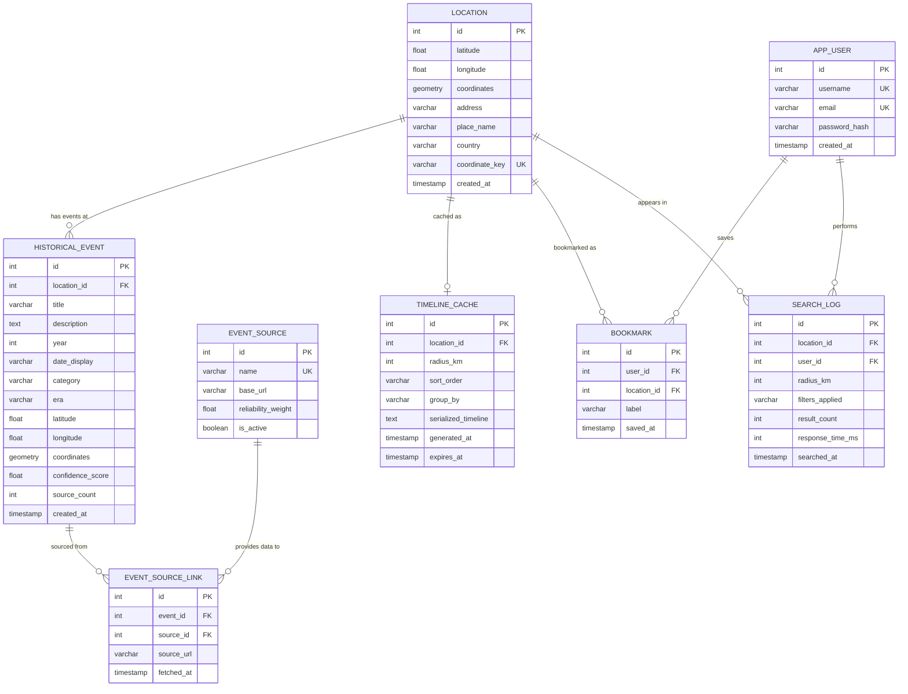

# ER Diagram — ChronoLens



---

## Table Descriptions

| Table | Purpose |
|---|---|
| `LOCATION` | Every unique location that has been searched. `coordinate_key` (e.g. `18.52_73.85`) is used as a natural cache key. The `coordinates` column is a PostGIS `GEOMETRY(Point, 4326)` — enables radius search and distance sorting in SQL. |
| `HISTORICAL_EVENT` | One row per deduplicated, structured historical event. Stores the final output after extraction, categorization, and scoring. Also has a PostGIS `coordinates` column for viewport queries. |
| `EVENT_SOURCE` | Master list of data sources (Wikipedia, Wikidata, GeoNames) with reliability weights. Weights are used by `ScoringService` to calculate confidence scores. |
| `EVENT_SOURCE_LINK` | Junction table linking each event to one or more sources. An event linked to 3 sources scores higher than one linked to 1. This table directly powers the confidence scoring system. |
| `TIMELINE_CACHE` | Persisted cache for generated timelines. Checked before any external API calls. Has TTL via `expires_at` — expired rows are ignored and regenerated. |
| `APP_USER` | Application user — required for bookmark and search history features. |
| `BOOKMARK` | Users save named bookmarks for locations they want to revisit. |
| `SEARCH_LOG` | Audit log of all searches — used for trend analysis, API usage monitoring, and detecting repeated coordinates. |

---

## PostGIS Columns Explained

The `coordinates` column in `LOCATION` and `HISTORICAL_EVENT` is not a regular number — it is a PostGIS spatial type:

```sql
-- in Prisma schema (raw SQL migration)
ALTER TABLE locations ADD COLUMN coordinates GEOMETRY(Point, 4326);
ALTER TABLE historical_events ADD COLUMN coordinates GEOMETRY(Point, 4326);

-- insert a point
UPDATE locations SET coordinates = ST_SetSRID(ST_MakePoint(73.85, 18.52), 4326) WHERE id = 1;

-- radius search: find all events within 10km of Pune
SELECT * FROM historical_events
WHERE ST_DWithin(
    coordinates::geography,
    ST_SetSRID(ST_MakePoint(73.85, 18.52), 4326)::geography,
    10000
);

-- viewport query: find events visible in current map bounds
SELECT * FROM historical_events
WHERE ST_Within(
    coordinates,
    ST_MakeEnvelope(73.0, 18.0, 74.5, 19.0, 4326)
);

-- distance sort: return events ordered by proximity to a point
SELECT *, ST_Distance(coordinates::geography, ST_MakePoint(73.85, 18.52)::geography) AS distance_m
FROM historical_events
ORDER BY distance_m ASC;
```

---

## Key Relationships

| Relationship | Cardinality | Meaning |
|---|---|---|
| LOCATION → HISTORICAL_EVENT | One-to-many | One location has many events associated with it |
| HISTORICAL_EVENT → EVENT_SOURCE_LINK | One-to-many | One event can be backed by multiple sources |
| EVENT_SOURCE → EVENT_SOURCE_LINK | One-to-many | One source (Wikipedia) provides data for many events |
| LOCATION → TIMELINE_CACHE | One-to-one | Each location has at most one active cached timeline |
| APP_USER → BOOKMARK | One-to-many | A user can bookmark many locations |
| LOCATION → BOOKMARK | One-to-many | A location can be bookmarked by many users |