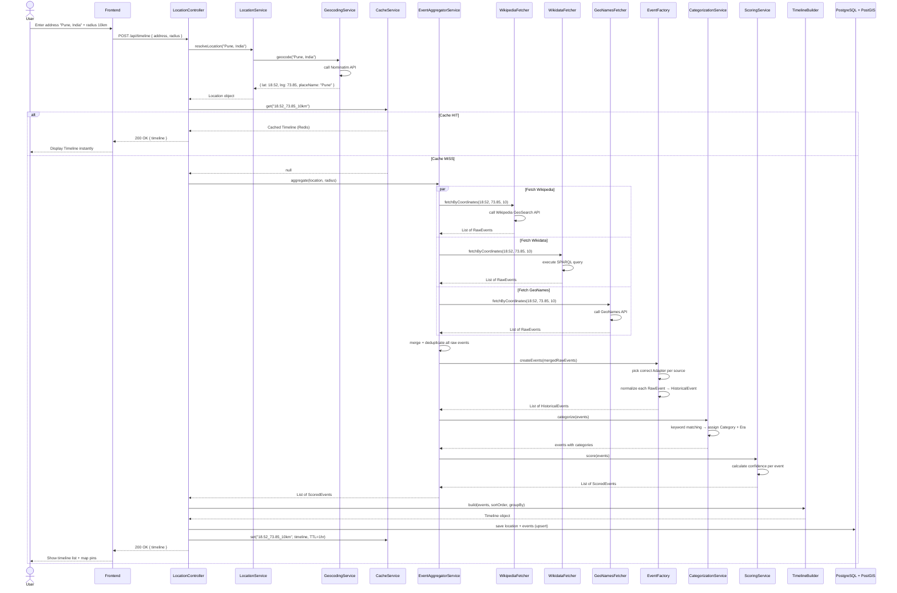
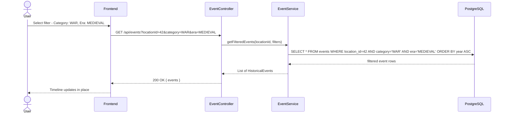
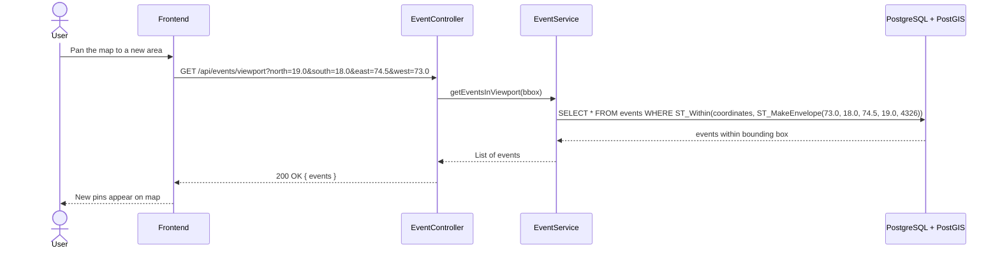

# Sequence Diagram - ChronoLens

## Main Flow: User Searches a Location → Gets Historical Timeline

---

## Secondary Flow: Filter Events Within a Timeline

---

## Secondary Flow: Map Viewport Fetch (PostGIS)

---

## Flow Design Decisions

| Decision | Reason |
|---|---|
| Parallel fetching with `Promise.all` | All 3 fetchers run concurrently - faster than sequential calls |
| Cache checked before any external call | Avoids all API calls for repeated locations |
| Graceful degradation | Each fetcher is wrapped in try/catch - if one fails, aggregator logs it and continues with the rest |
| Deduplication before extraction | Removes duplicate raw events first so the extraction step does less work |
| PostGIS for viewport fetch | Spatial query in DB is far more efficient than fetching all events and filtering in Node.js |