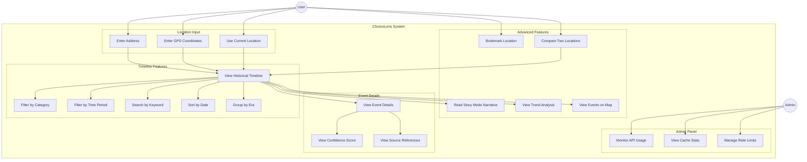

# Use Case Diagram — ChronoLens

---

## Actor Descriptions

| Actor | Description |
|---|---|
| **User** | Any person who interacts with the app — enters a location, explores the timeline, bookmarks places, reads story mode |
| **Admin** | System administrator who monitors external API health, cache hit rates, and rate limit usage |

---

## Use Case Descriptions

| Use Case | Description |
|---|---|
| Enter Address | User types a city, landmark, or address — system geocodes it to lat/lng via Nominatim |
| Enter GPS Coordinates | User provides lat/lng directly — skips geocoding step |
| Use Current Location | Browser Geolocation API provides coordinates automatically |
| View Historical Timeline | Core use case — backend fetches, aggregates, cleans, scores, and returns sorted events |
| Filter by Category | Narrow results to War, Science, Culture, Disaster, Politics, or Births/Deaths |
| Filter by Time Period | Restrict to Ancient / Medieval / Colonial / Modern or a custom year range |
| Search by Keyword | Full-text search across event titles and descriptions |
| View Confidence Score | Each event shows a 0–100 reliability score based on source count and weight |
| View Story Mode | Backend narrates the location's history as a flowing readable paragraph |
| Bookmark Location | Save a location to personal history for later retrieval |
| Compare Two Locations | Side-by-side historical event count and category breakdown of two places |
| View Trend Analysis | Visual breakdown of which event categories dominate this location |
| View Events on Map | React Leaflet map with clustered pins — click a pin to see event details |